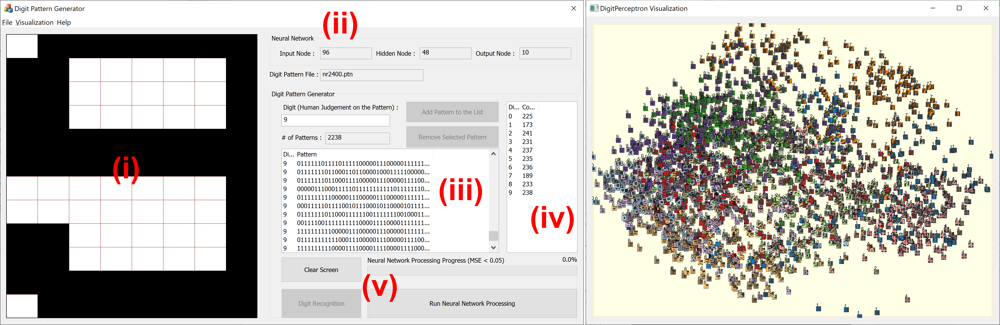

# DigitPerceptron (neural network trainer)
Interactive Digit Recognition

This is created with Visual Studio 2019 using VC++.

It uses multiple 64bit external libraries. All necessary library files are included under the subfolder (lib).
- Eigen 3.3.7 (for matrix computation)
- freeglut 3.2.1 (for OpenGL rendering)
- ALGLIB 3.10.0  (for SVD computation)
- FTGL & FreeType (for text rendering on GL space)

The neural network trainer system consists of two layouts – digit pattern generator (left) and visual analyzer(right). The digit pattern generator supports the user in generating digit patterns and training neural networks. The visual analyzer represents user-generated digit patterns on a PCA projection space.

Digit Pattern Generator includes a pattern grid (i) with multiple control panels (ii) $\sim$ (v). The pattern grid allows the user to create digit patterns (i.e., 0 $\sim$ 9) by clicking each cell in the pattern grid. It has 12 × 8 grid cells representing a digit pattern. Each cell holds binary information as 1 or 0. It shows the size of NNs, including nodes in input, hidden, and output layers (ii). Two list boxes have been added to keep all created digit patterns and the total number of patterns representing each digit in (iii) and (iv), respectively. Real-time training and testing of NNs are handled with the control buttons (v). The result of the recognized digit pattern with NN appears with probability distributions (vi). Visual Analyzer represents user-generated digit patterns in a 2D display space by applying PCA computation. 

With the designed tool, the following paper has been published. 
- Dong H. Jeong, Jin-Hee Cho, Feng Chen, Audun Josang, Soo-Yeon Ji, Active Learning on Neural Networks through Interactive Generation of Digit Patterns and Visual Representation, 13th IEEE Integrated STEM Education Conference, 2023
